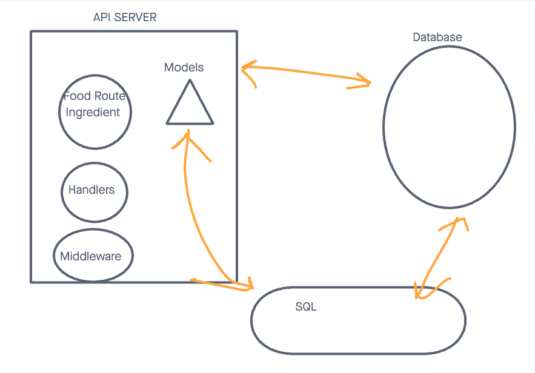

# LAB - Class 03

## Project: Express REST API

### Author: Malik Sadiki-Torres

### Problem Domain

This very basic express server that sends request to a REST API

### Links and Resources

- [GitHub Actions ci/cd](https://github.com/MalikTorres/basic-express-server)
- [back-end server](https://server-deployment-practice-piak.onrender.com)

### Collaborators
I followed Ryan Gallaways demo code and discussed the LAB with Kaeden O'meara

### Setup

Install required dependecies and create postgre database

#### `.env` requirements (where applicable)

port variable exists within the env sample

#### How to initialize/run your application (where applicable)

clone repo, `npm i`, then run `nodemon` in the terminal

#### Routes

- GET : `/food/1` - specific route to hit

#### Tests

to run tests, after running `npm i`, run the command `npm test`

#### UML

